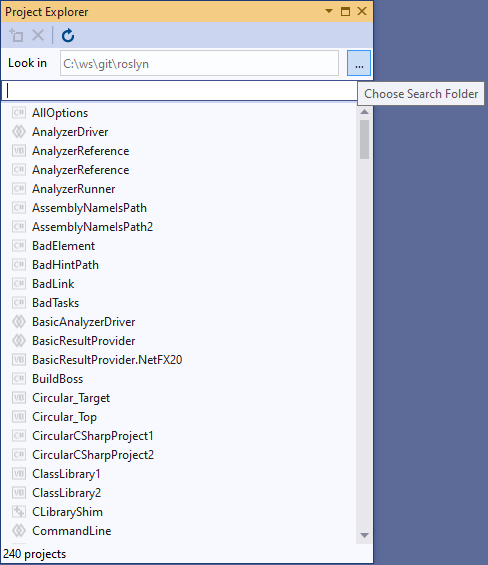
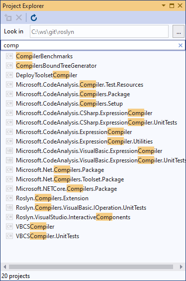
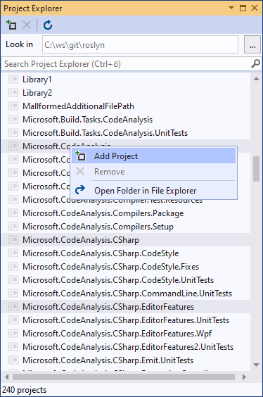
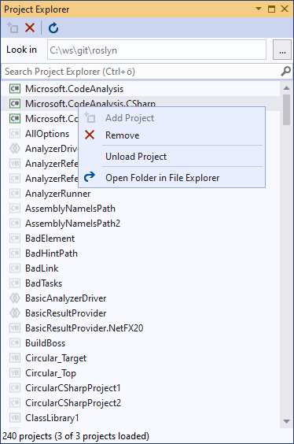
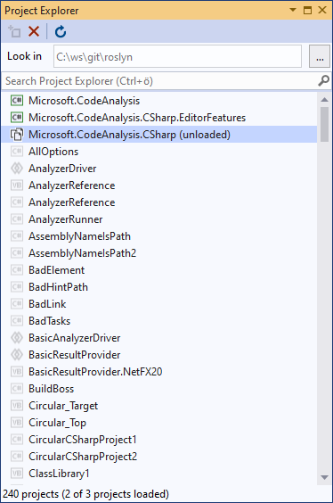

# Project Explorer for Visual Studio
| Branch | Status |
|--------|---------|
|**master**||
|**vs2019**||

## Overview
Project Explorer is a small tool window for managing a large number of projects within a given search folder. 
Quickly search for projects and then load, unload or close them respectivley. 

## Get a list of all projects within a choosen search folder

## Filter projects by name

## Add, remove or unload projects

## Get a quick overview of loaded, unloaded or closed projects

