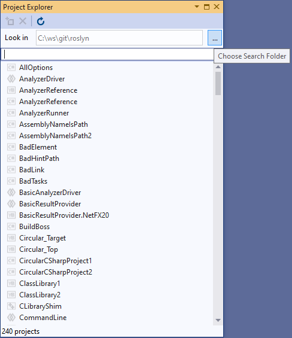
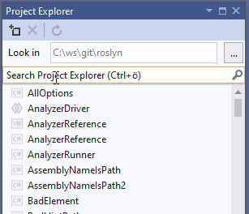
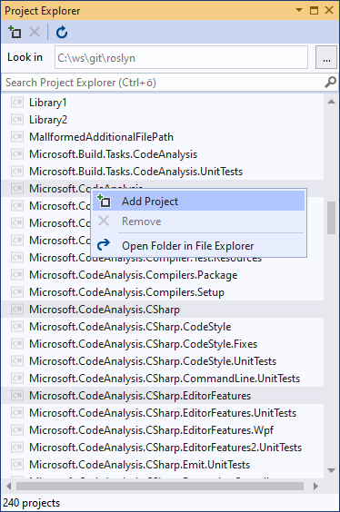
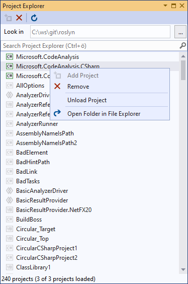
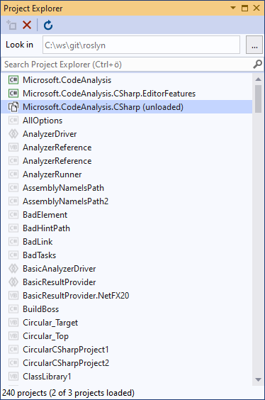

# Project Explorer for Visual Studio
| Branch | Status |
|--------|---------|
|**master**|[](https://ci.appveyor.com/project/IInspectable/projectexplorer/branch/master)|
|**vs2022**|[](https://ci.appveyor.com/project/IInspectable/projectexplorer/branch/vs2022)|

## Overview
Project Explorer is a small tool window for managing a large number of projects within a given search folder. 
Quickly search for projects and then load, unload or close them respectivley. 

## Get a list of all projects within a choosen search folder


## Filter projects by name


## Add, remove or unload projects



## Get a quick overview of loaded, unloaded or closed projects


## Development

Building, packaging and versioning run through a set of PowerShell commands (alias `pe`) in
[`Tools/Commands`](Tools/Commands/README.md). Requirements: Visual Studio 2026 with the
"Visual Studio extension development" workload and PowerShell 7.

Load the commands once per session, or permanently via your `$PROFILE`:

```powershell
. "<repo>\Tools\Commands\Import-PeCommands.ps1"
```

Common tasks:

```powershell
pe build      # restore + debug build
pe vsix       # clean release build, VSIX in deploy\
pe install    # install the VSIX from deploy\
pe incbuild   # bump the version (also incminor/incmajor) and rebuild the VSIX
pe            # interactive menu of all commands
```

The version lives in `Version.props`. See [`Tools/Commands/README.md`](Tools/Commands/README.md)
for all commands and details (German).
